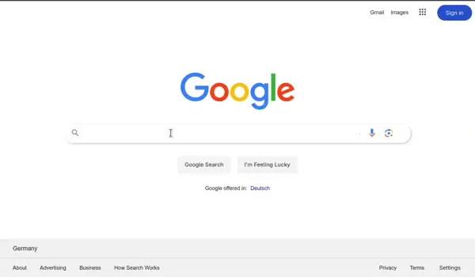

# Google search clone

A web application that leverages Google's Custom Search JSON API. Users can input queries and retrieve relevant search results powered by Google's search engine, all within a responsive interface built with React.



## ⛏️ Built with

- **Vite**: A fast, opinionated build tool for modern web development.
- **React**: A JavaScript library for building user interfaces.

## 🗃️ Features

- Darkmode
- Pagination
- Infinite Scroll
- Mobile view
- Custom skeleton loading effect
- Popup Menu for "Quick Settings" and "Google Apps" buttons on click.

## 🔧 Setup

1. **Create Programmable Search Engine to receive an api key and CSE-ID go to** 🔑 https://developers.google.com/custom-search/v1/introduction

2. **Clone and Install**

```bash
git clone https://github.com/setAutomata/google-clone.git
cd google-clone
npm i
```

3. **Create .env or .env.local file and edit it as follows:**

```
VITE_APP_API_ENDPOINT = https://www.googleapis.com/customsearch/v1
VITE_APP_API_KEY = <your google custom search JSON API key>
VITE_APP_CSE_ID = <your cse id>
```

4. **Run the app**

```bash
npm run dev
```

## 🚀 Live Demo
[Click here for a realtime demonestration](https://setautomata.github.io/google-clone/)
